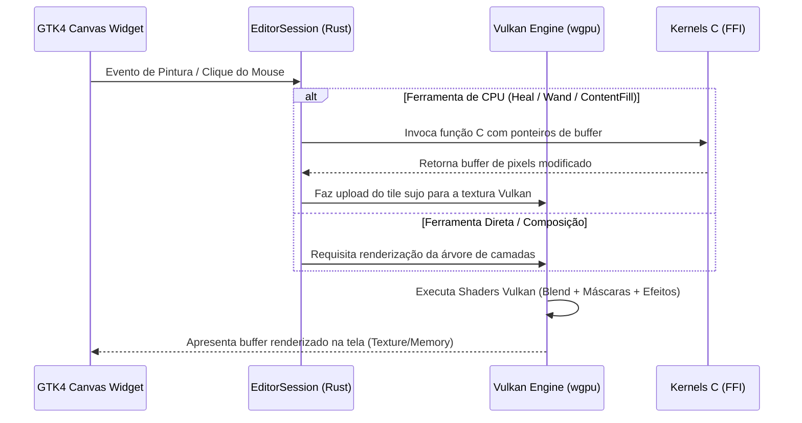

# Especificação Técnica de Arquitetura — Photoslop (/to-spec)
> Tradução e porte do editor de imagens **Compositor (macOS)** para uma aplicação nativa de alta performance em **Linux**, utilizando **Rust**, **GTK4 / Libadwaita** e **Vulkan**.

---

## 1. Visão Geral e Princípios de Design

O **Photoslop** é um editor de imagens e composição não destrutivo, de código aberto, concebido para oferecer uma experiência fluida no Linux equivalente ao Photoshop e ao Compositor.

### Princípios Fundamentais:
1. **Nativo do Linux:** Integração perfeita com Wayland e X11, seguindo os padrões do ecossistema GNOME via GTK4 e Libadwaita.
2. **Máxima Eficiência de Hardware:** Renderização acelerada via Vulkan, compatível com GPUs **AMD** (Mesa RADV) e **NVIDIA** (drivers proprietários / NVK).
3. **Segurança de Memória e Robustez:** Lógica de controle, sessões de edição e estruturas de dados implementadas em **Rust**, eliminando falhas de segmentação.
4. **Reaproveitamento de Kernels C:** Execução direta e sem sobrecarga (zero-overhead FFI) dos algoritmos de manipulação de pixels em C já testados no Compositor.
5. **Compatibilidade Total:** Leitura e escrita do formato de projeto `.comp` (versões 1 a 11), permitindo intercâmbio de arquivos com o Compositor original no macOS.

---

## 2. Stack Tecnológica

| Componente | Tecnologia Selecionada | Papel no Sistema | Justificativa |
| :--- | :--- | :--- | :--- |
| **Linguagem Principal (Core)** | **Rust** (Edição 2021/2024) | `EditorSession`, Documento, Histórico, I/O | Segurança de concorrência, ausência de coletor de lixo, desempenho de ponta e facilidade com pacotes (`Cargo`). |
| **Camada de UI** | **GTK4 + Libadwaita** (`gtk4-rs`, `libadwaita-rs`) | Janela, Abas, Painéis de Camadas, Controles | Padrão moderno no Linux/GNOME, suporte nativo a HiDPI, Wayland, gestos de toque e tablets gráficos. |
| **Motor de Renderização GPU** | **Vulkan** (via `wgpu-rs` com backend Vulkan) | Pipeline de composição de camadas, blend modes e efeitos | Acesso de baixo nível à GPU com compatibilidade completa e otimizada para AMD e NVIDIA. |
| **Kernels de Processamento CPU** | **C99 Puro** (compilado via `cc-rs`) | `AdjustPixels`, `HealPixels`, `ContentFill`, `WandPixels` | Reaproveitamento direto dos 9 módulos C de alta eficiência do projeto original sem reescrita. |
| **Manipulação de Imagens e I/O** | `image`, `png`, `zune-jpeg`, `serde_json` | Leitura/escrita de PNGs, JPEGs, TIFFs e manifestos `.comp` | Bibliotecas nativas e seguras em Rust com alta velocidade de decodificação. |
| **Integração de Canvas** | `gtk4::DrawingArea` + `gdk::MemoryTexture` / DMA-BUF | Apresentação do canvas renderizado na interface | Atualização em 60+ FPS sincronizada com o compositor Wayland/X11 sem bloqueios na UI. |

---

## 3. Arquitetura de Módulos (Crates / Componentes)

O projeto é estruturado em uma workspace Cargo modular ou módulos desacoplados:

```
Photoslop/
├── c_kernels/                   # Código C original importado do Compositor
│   ├── AdjustPixels.c / .h      # Ajustes de níveis, curvas, matiz e saturação
│   ├── BrushPixels.c / .h       # Rasterização de carimbo e traço de pincel
│   ├── ContentFill.c / .h       # Síntese de preenchimento baseado em conteúdo
│   ├── DitherPixels.c / .h      # Algoritmos de pontilhamento / dithering
│   ├── HealPixels.c / .h        # Pincel de recuperação e síntese de textura
│   ├── LensPixels.c / .h        # Correção de distorção de lente
│   ├── LevelsPixels.c / .h      # Ajuste por canais de cores
│   ├── NoisePixels.c / .h       # Geração de ruído procedural
│   └── WandPixels.c / .h        # Algoritmo de inundação (flood-fill) da varinha
├── src/
│   ├── main.rs                  # Ponto de entrada da aplicação GTK4
│   ├── app.rs                   # Ciclo de vida da aplicação (`adw::Application`)
│   ├── core/                    # Módulo central de domínio (sem dependência de UI)
│   │   ├── mod.rs
│   │   ├── document.rs          # Estrutura do documento, camadas e metadados
│   │   ├── layer.rs             # Tipos de camada (Pixel, Grupo, Ajuste, Texto, Forma)
│   │   ├── blend.rs             # Enumeração e lógica matemática dos blend modes
│   │   ├── mask.rs              # Máscaras de camada, recorte e pastas
│   │   ├── history.rs           # Sistema de Desfazer/Refazer (Undo/Redo) baseado em comandos
│   │   ├── selection.rs         # Buffer de máscara de seleção ativa e operações booleanas
│   │   └── session.rs           # EditorSession: orquestrador entre ferramentas e documento
│   ├── io/                      # Persistência e exportação
│   │   ├── comp_format.rs       # Leitura e escrita atômica do formato .comp v1–v11
│   │   ├── manifest.rs          # Serialização/desserialização do manifest.json com Serde
│   │   ├── image_io.rs          # Importação e exportação PNG, JPEG, TIFF
│   │   └── psd_reader.rs        # Decodificador de documentos Photoshop PSD/PSB
│   ├── render/                  # Motor de renderização Vulkan
│   │   ├── mod.rs
│   │   ├── vulkan_context.rs    # Inicialização de Device, Queue e Adapter (AMD/NVIDIA)
│   │   ├── pipeline.rs          # Pipelines gráficos e compute de mesclagem e efeitos
│   │   ├── layer_renderer.rs    # Composição bottom-to-top com ordenação em árvore
│   │   ├── effects.rs           # Shaders de Sombra, Traçado, Brilho e Desfoque
│   │   └── texture_cache.rs     # Gerenciamento de pool de texturas e downsampling
│   ├── ffi/                     # Interoperabilidade segura com os Kernels C
│   │   ├── mod.rs
│   │   └── c_bindings.rs        # Wrappers idiomáticos em Rust para as funções C
│   └── ui/                      # Camada de Interface Gráfica GTK4 / Libadwaita
│       ├── mod.rs
│       ├── window.rs            # Janela principal (`AdwApplicationWindow`)
│       ├── canvas_widget.rs     # Widget customizado do Canvas (zoom, pan, pintura)
│       ├── header_bar.rs        # Barra superior com ações, abas e status
│       ├── tool_bar.rs          # Barra vertical de ferramentas (Pincel, Seleção, etc.)
│       ├── tool_options.rs      # Barra contextual de parâmetros da ferramenta ativa
│       ├── layers_panel.rs      # Painel lateral de gerenciamento de camadas
│       ├── adjustments_panel.rs # Painel de ajustes de cor e filtros
│       ├── history_panel.rs     # Lista visual de passos do histórico
│       └── dialogs/             # Caixas de diálogo (Tamanho da Imagem, Exportar, etc.)
└── build.rs                     # Script de compilação dos kernels C com o crate `cc`
```

---

## 4. Pipeline Gráfico e Renderização Vulkan

### 4.1 Seleção de Dispositivo e Suporte a GPUs
O motor de renderização inicializa a instância Vulkan através do `wgpu`:
- **NVIDIA:** Seleciona o adaptador Vulkan do driver oficial proprietário (`libvulkan.so`), suportando filas assíncronas de computação e renderização.
- **AMD:** Seleciona o driver Mesa RADV, com compilação de shaders ACO de alta performance.
- **Fallback:** Suporte a Vulkan via Lavapipe (renderização por software via CPU) caso nenhuma GPU dedicada ou integrada seja detectada.

### 4.2 Pipeline de Composição de Camadas
A composição de camadas é executada em espaço de cor linear sRGB:
1. **Passo 1 (Camada Base):** Cada camada de pixel ativa é vinculada a uma textura Vulkan (`Rgba8Unorm` ou `Rgba16Float`).
2. **Passo 2 (Modulação de Máscara):** Se a camada possuir máscara de raster, máscara de recorte ou máscara de pasta, um shader de fragmento multiplica a cobertura pelo canal alfa da imagem.
3. **Passo 3 (Efeitos de Camada):** Os shaders de efeitos (Traçado, Sombra Projetada, etc.) processam a textura da camada offscreen.
4. **Passo 4 (Mesclagem Acumulada):** O shader de composição mescla a camada processada sobre o acumulador do documento de baixo para cima, aplicando a fórmula exata do *Blend Mode* e a opacidade da camada/pasta.
5. **Passo 5 (Apresentação no Canvas):** O buffer resultante da composição é exibido com suporte a zoom contínuo, pan e rotação com interpolação de alta qualidade.



---

## 5. Estratégia de I/O e Compatibilidade de Projeto

### 5.1 Serialização do `manifest.json`
Utilização da biblioteca `serde` com `serde_json` em Rust para garantir compatibilidade binária e estrutural com o Compositor do macOS:

```rust
#[derive(Serialize, Deserialize, Debug, Clone)]
pub struct Manifest {
    pub version: u32,                  // Suporte a versões 1 até 11
    #[serde(rename = "bundleID")]
    pub bundle_id: String,             // "com.compositor.project"
    pub id: String,                    // UUID do documento
    pub width: u32,
    pub height: u32,
    #[serde(default = "default_dpi")]
    pub resolution: f32,               // DPI (padrão 72.0)
    #[serde(rename = "activeLayerID")]
    pub active_layer_id: String,
    pub layers: Vec<LayerRecord>,
    #[serde(default)]
    pub guides: Vec<GuideRecord>,
}
```

### 5.2 Salvamento Atômico
- O projeto é escrito em uma pasta temporária adjacente (`.comp.tmp-UUID`).
- As camadas PNG inalteradas são linkadas por hard link ou copiadas com cache de hash.
- O manifesto atualizado é gravado e sincronizado com `fsync`.
- A substituição da pasta antiga pela nova é realizada de forma atômica no sistema de arquivos Linux (`renameat2` ou substituição transacional de diretório).

---

## 6. Modelo de Concorrência e Threads

1. **Thread Principal de UI (GLib / GTK Event Loop):**
   - Responsável exclusiva por desenhar os controles da interface e receber eventos de entrada (mouse, teclado, mesa digitalizadora).
   - Nunca executa operações bloqueantes de I/O ou cálculos intensivos de pixels.
2. **Thread Dedicada da GPU (Render Worker):**
   - Recebe requisições de renderização através de canais sem bloqueio (`crossbeam_channel`).
   - Gerencia a fila de comandos Vulkan e as texturas.
3. **Pool de Tarefas em Segundo Plano (Rayon / Tokio):**
   - Executa tarefas pesadas em paralelo: decodificação de PSDs, exportação de imagens, cálculo de histograma e preenchimento sensível ao conteúdo.

---

## 7. Critérios de Desempenho e Metas Técnicas

- **Taxa de Quadros no Canvas:** 60+ FPS estáveis durante operações de Pan, Zoom e pintura interativa com o pincel.
- **Latência de Entrada:** < 16ms entre o movimento do ponteiro/caneta e a resposta visual do traço no canvas.
- **Consumo de Memória:** Tiling inteligente em documentos de grande resolução para operar dentro do limite de memória do sistema sem estouro (*Out Of Memory*).
